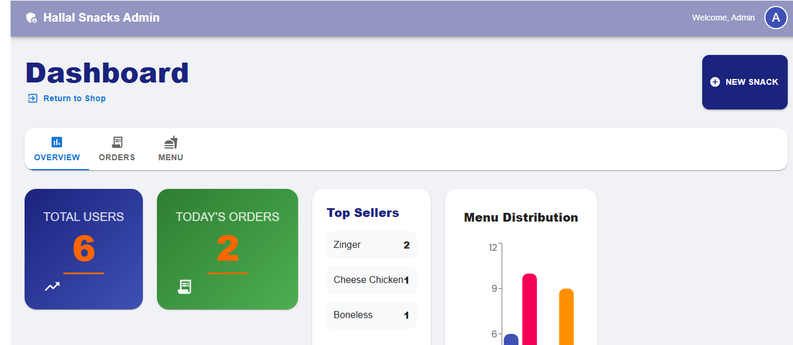
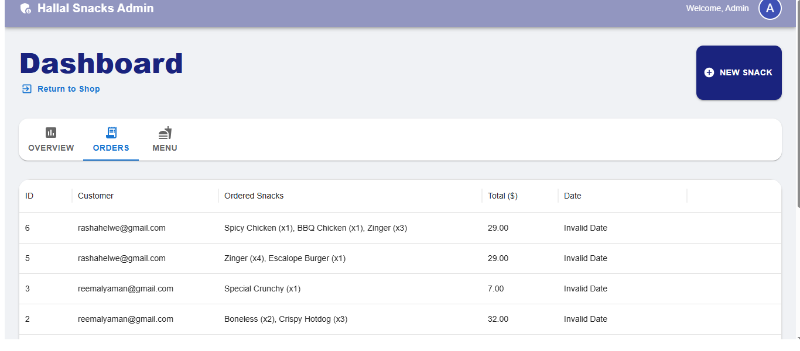
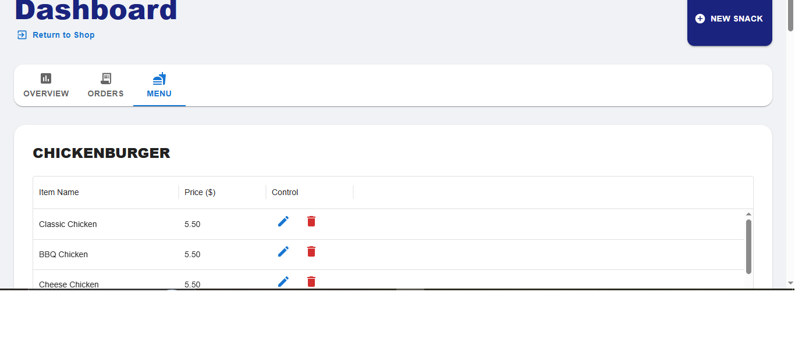
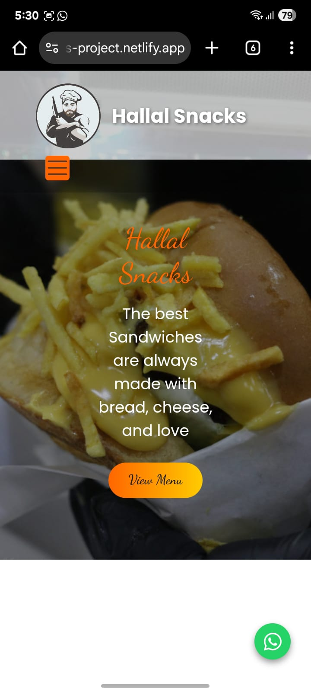
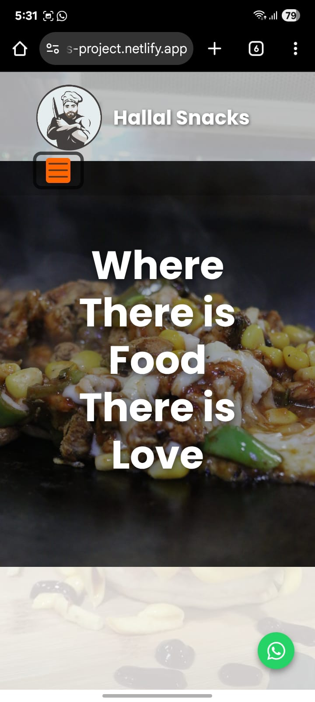
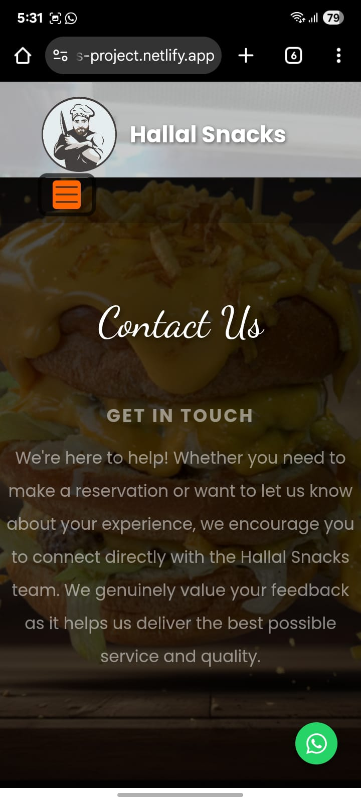
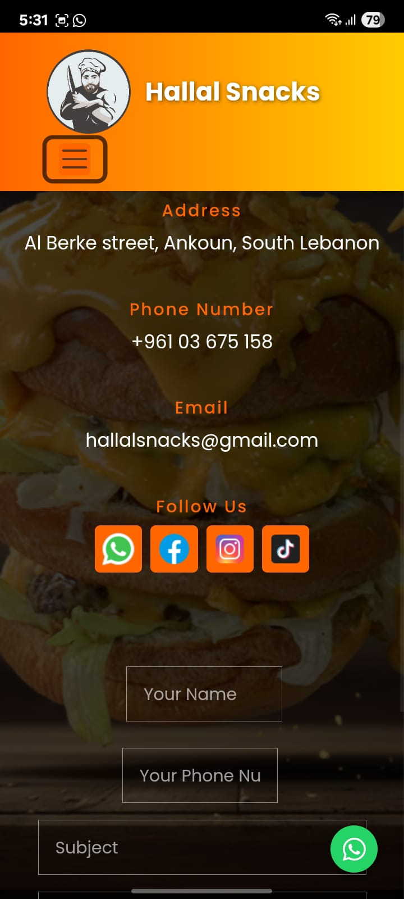

# Hallal Snacks: Full-Stack Ordering & Management System
## Project Overview:

This project is a comprehensive web application for Hallal Snacks:
Phase 1: Focused on a responsive customer interface where users can browse a dynamic menu and order via WhatsApp.
Phase 2: Introduced a secure Admin Dashboard, a Node.js/Express Backend, and a MySQL Database to manage the business in real-time.

## Technical Stack:

### Frontend (Customer & Admin):

1. React.js (Hooks & Functional Components).
2. Material UI (MUI) (Professional Admin Dashboard components).
3. Bootstrap & Custom CSS (Responsive design).
4. Recharts (Interactive business analytics).
5. React Router DOM (Navigation):

### Backend & Database.
1. Node.js & Express.js (REST API).
1. MySQL (Relational Database).
3. Axios (Frontend-to-Backend communication).

## Key Features:

### Customer Side (Phase 1):

1. Global Shopping Cart: Add, remove, and update quantities easily.
2. WhatsApp Ordering: Instant checkout that sends orders directly to the restaurant.
3. Responsive UI: Optimized for mobile and desktop viewing.

### Admin Dashboard (Phase 2):

1. Business Analytics: Real-time charts showing total users, daily orders, and top-selling items.
2. Menu Management (CRUD): Add new snacks, update prices, or delete items instantly.
3. Order Tracking: A professional data grid to view and manage all incoming customer orders.
4. Image Upload: Integrated system to upload product images directly to the server.

## Database Setup:

To recreate the database, use the provided SQL file:
1. Create a database in your local MySQL server.
2. Import the hallal_snacks.sql file located in the root directory.

## Setup & Installation:

1. Clone the repository: git clone https://github.com/reemsaijary/Hallal-Snacks-Project.git
2. Install Dependencies:
Frontend: cd frontend && npm install
Backend: cd backend && npm install
3. Run the Project:
Start Backend: cd backend && node server.js
Start Frontend: cd frontend && npm start

## File Structure Overview:

**src/App.js** -->	Main component, sets up routes and wraps the app with CartProvider.

**src/context/CartContext.js**--> Global state for the shopping cart and logic for adding/removing items.

**src/Data/MenuData.js** --> Data for all menu items, names, prices, ingredients, and categories.

**src/pages/Menu.js** --> Displays the dynamic menu and handles adding items to the cart.

**src/pages/Cart.js** --> Shows the cart, controls quantities, and includes the WhatsApp checkout modal.

**src/pages/Home.js** --> Home page layout with hero section and call-to-actions.

**src/pages/About.js**--> About page with restaurant info and story.

**src/pages/Contact.js**--> Contact page with form and social icons.

**src/components/Navbar.js** --> Navigation bar with scroll effects and dynamic cart badge.

**src/components/Footer.js** --> Fixed Footer for all pages.

**src/components/WhatsAppIcon.js** --> Fixed WhatsApp button across all pages.

**src/pages/Login.js** --> login/ sign up for user and admins

**src/pages/OrderHistory** --> Save orfer history for a user

**src/admin/AdminDashboard.js** --> The main management hub with Tabs for Insights, Orders, and Menu control.

**backend/server.js** --> The Express server connecting the frontend to the MySQL database.

**src/Styling/.css** --> CSS files for custom theme, responsiveness, and layout.

**public/**	--> Contains static assets like images, favicon, and index.html.

## Screenshots:

### Home Page 

  

  

### Menu Page 
The menu page displays all items categorized by type, with images, prices, 
and "Add to Cart" button, here some screenshots for menu. 
 
 

 The image popup appears when a user clicks on it

### Cart Page  
  
  

User sending order form
  

### Contact Page  

## Admin Overview

### Mobile View (Responsive Design)

  

 

## Author:
Reem Saijary(Worked individually on this project).