# Hallal Snacks Ordering System

## Project Overview:

This is a responsive web app for a restaurant called Hallal Snacks, made with React.js. Users can browse the menu, add items to the cart, and place orders directly via WhatsApp. The project shows skills in frontend development, responsive design, and deploying a live website.

## Technical Stack:

1. React.js (Functional Components & Hooks).
2. React Context API (Global Cart).
3. React Router DOM (Routing).
4. Bootstrap + Custom CSS (Layout & styling).
5. React Icons (Buttons & icons).

## Key Features:

1. Global Shopping Cart: Add, remove, and update items easily.
2. WhatsApp Ordering: Checkout sends order directly to WhatsApp.
3. Dynamic Images: Menu images load automatically based on item name.
4. Responsive UI: Works on mobile and desktop, with a fixed WhatsApp button.

## Setup & Installation:

1. Clone the repository:
    git clone https://github.com/reemsaijary/Hallal-Snacks-Project.git
2. Go to the project folder:
    cd hallal-snacks
3. Install dependencies:
    npm install
4. Run the application locally:
    npm start
  The app will open automatically in your browser at http://localhost:3000

## File Structure Overview:

**src/App.js** -->	Main component, sets up routes and wraps the app with CartProvider.

**src/context/CartContext.js**--> Global state for the shopping cart and logic for adding/removing items.

**src/Data/MenuData.js** --> Data for all menu items, names, prices, ingredients, and categories.

**src/pages/Menu.js** --> Displays the dynamic menu and handles adding items to the cart.

**src/pages/Cart.js** --> Shows the cart, controls quantities, and includes the WhatsApp checkout modal.

**src/pages/Home.js** --> Home page layout with hero section and call-to-actions.

**src/pages/About.js**--> About page with restaurant info and story.

**src/pages/Contact.js**--> Contact page with form and social icons.

**src/components/Navbar.js** --> Navigation bar with scroll effects and dynamic cart badge.

**src/components/Footer.js** --> Fixed Footer for all pages.

**src/components/WhatsAppIcon.js** --> Fixed WhatsApp button across all pages.

**src/Styling/.css** --> CSS files for custom theme, responsiveness, and layout.
g
**public/**	--> Contains static assets like images, favicon, and index.html.

## Screenshots:

### Home Page 

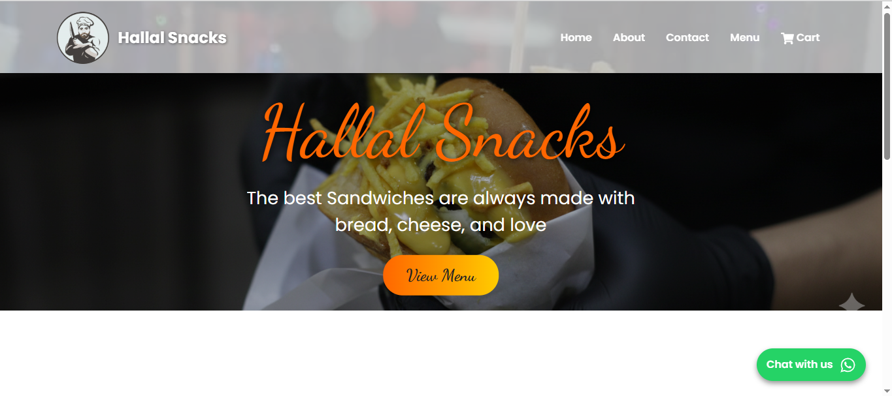  
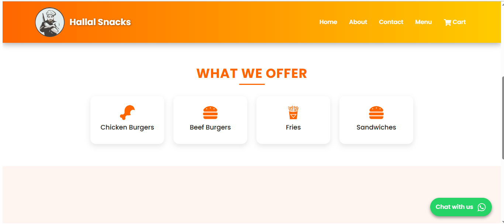
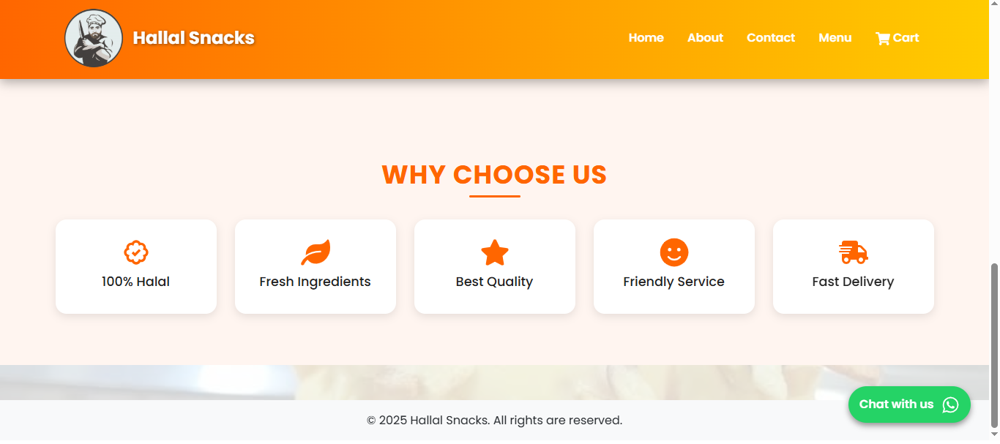  

### Menu Page 
The menu page displays all items categorized by type, with images, prices, 
and "Add to Cart" button, here some screenshots for menu. 
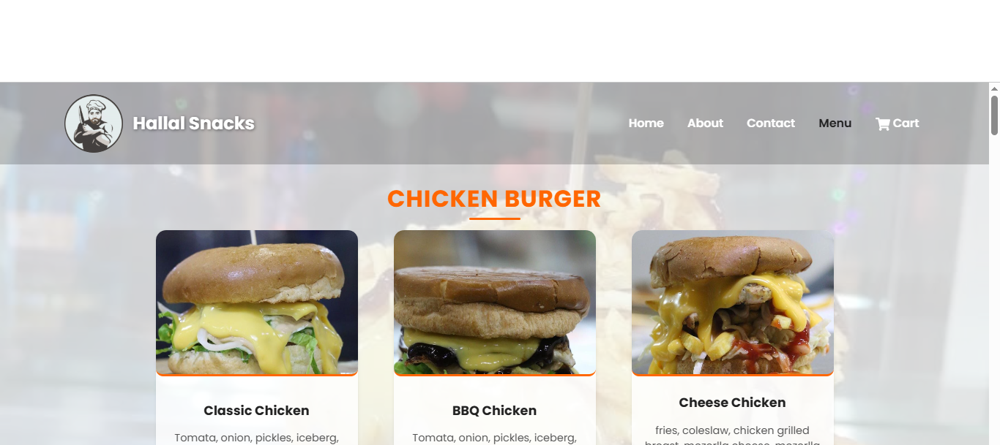 
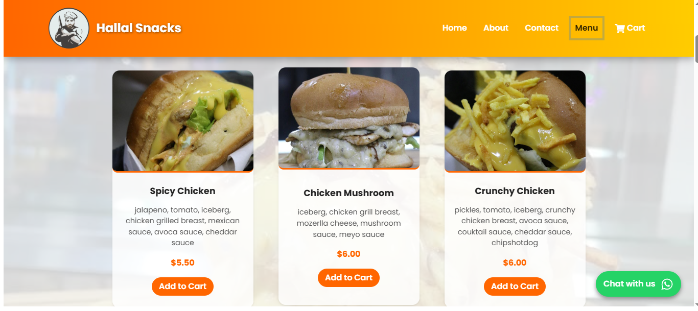 
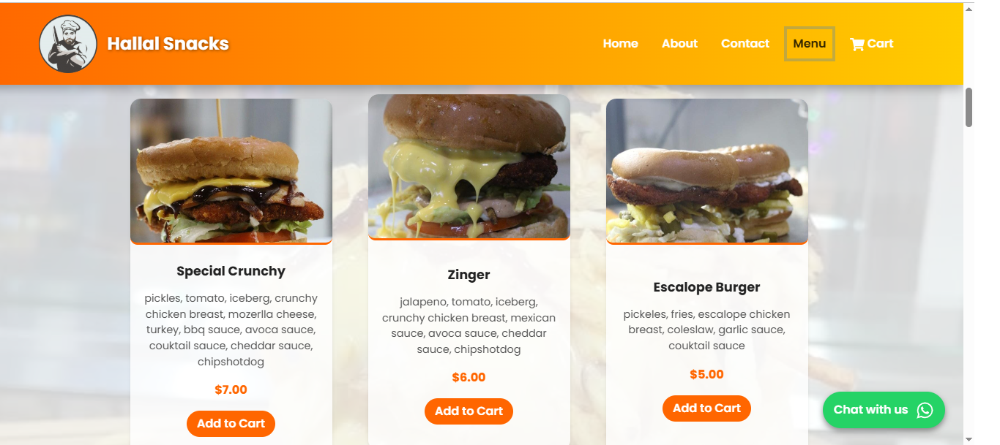
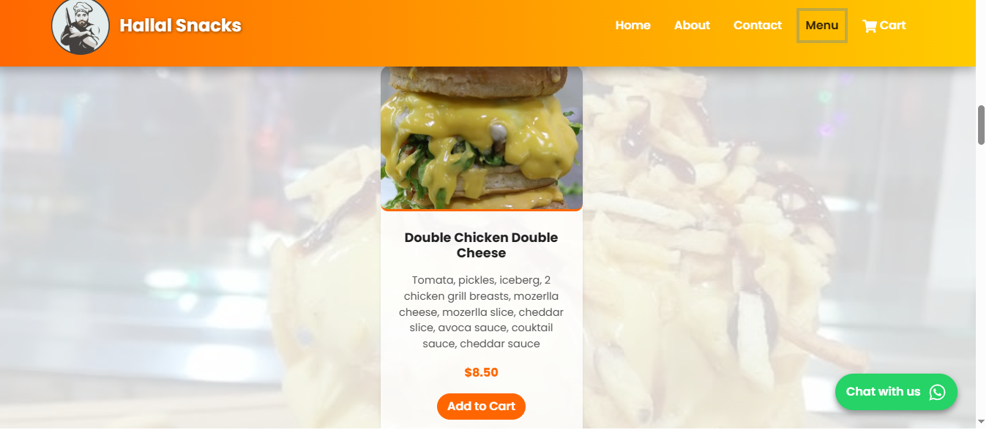
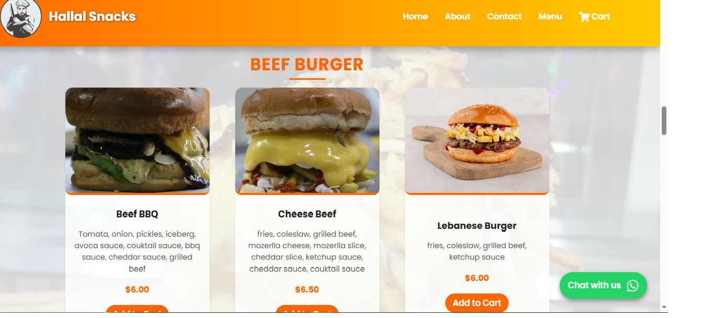
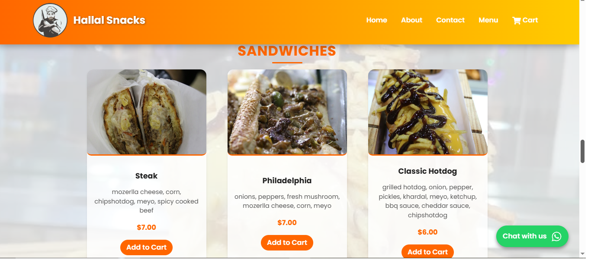
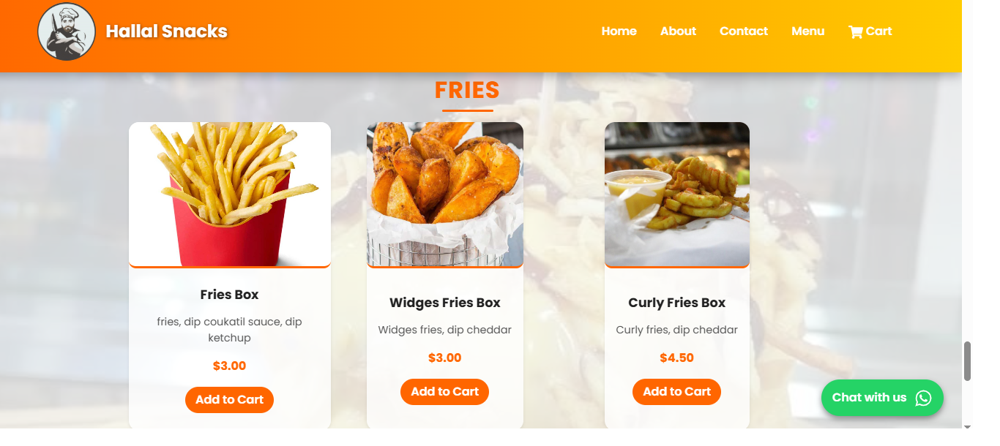
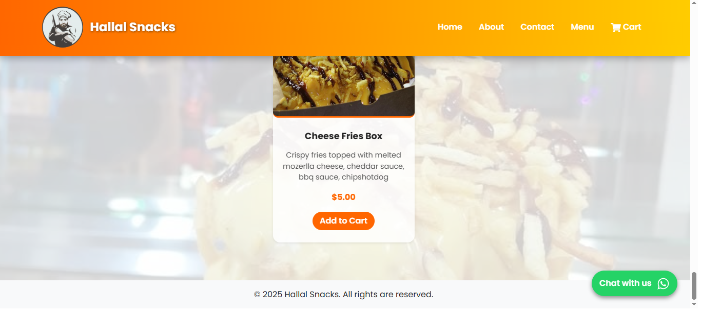
 The image popup appears when a user clicks on it
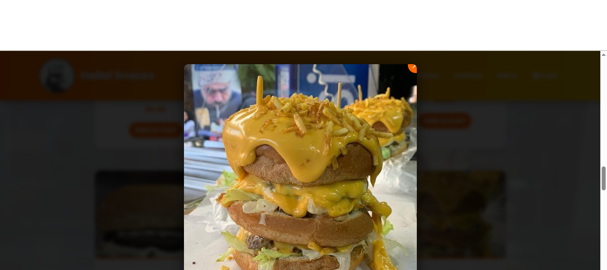

### Cart Page  
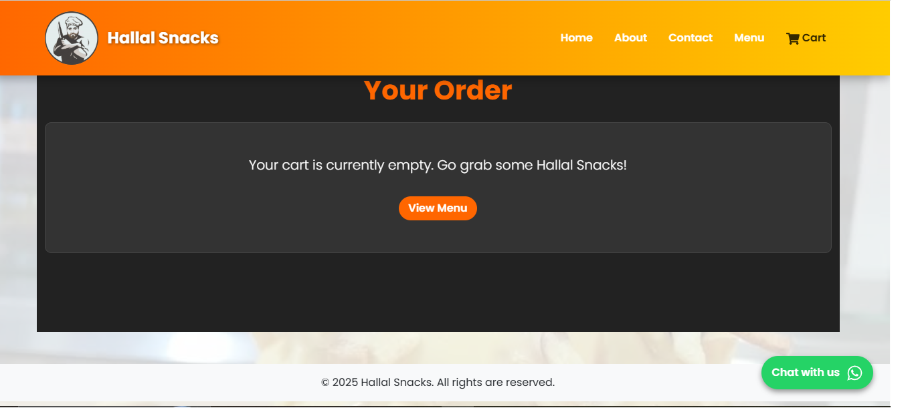  
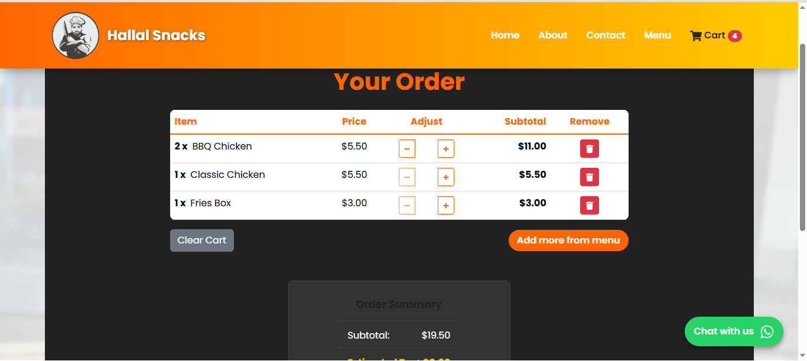  
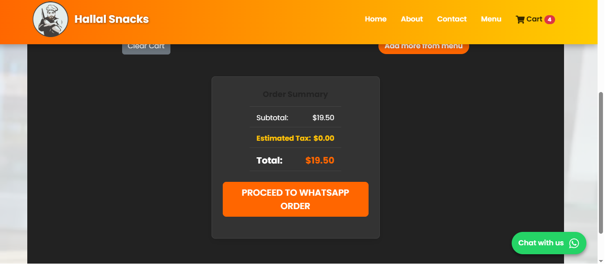
User sending order form
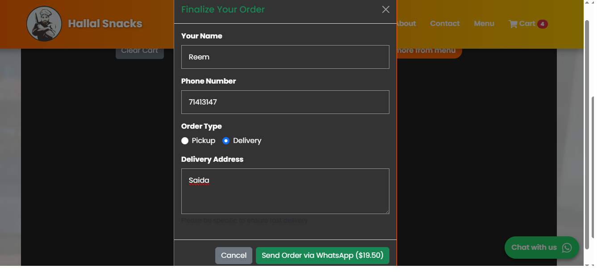  

### Contact Page  
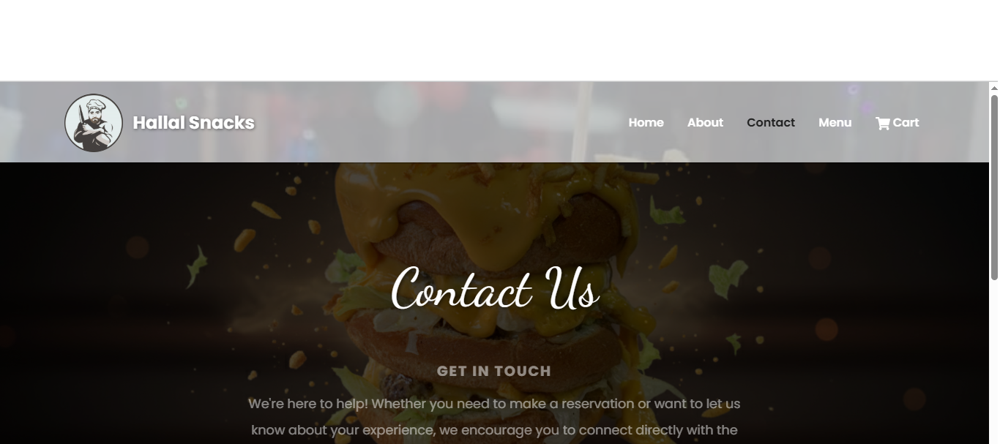
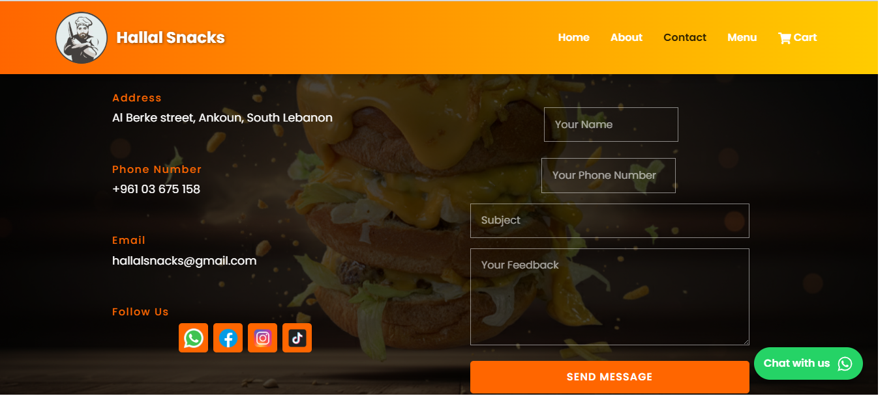

## Deployment:
You can view the live version of the app here:
Live App: https://hallal-snacks-project.netlify.app

## Author:
Reem Saijary(Worked individually on this project).